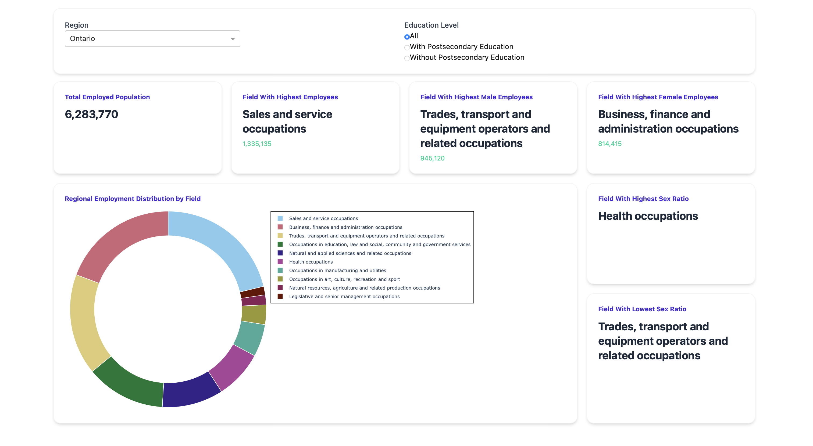

# Workforce Data Visualization

## Project Overview
This project is an interactive dashboard that analyzes workforce data from the 2021 Canadian Census. It helps users explore employment trends across different regions, occupations, education levels, and genders. The dashboard is built using Python with Dash (for the web interface) and Plotly (for visualizations).

### Key Features

- Interactive charts (bar graphs, pie charts, treemaps, polar plots)
- Filters to explore data by region, occupation, and education level
- Gender distribution analysis across different job fields
- Comparison of essential service workers (nurses, police, firefighters)
- Engineering workforce analysis for industries like electrical and mechanical engineering

## Dataset
The project uses data from Statistics Canada (2021 Census, Table: 98-10-0404-01). The dataset includes:
- Geographic regions (provinces and territories)
- Occupations (different job categories)
- Education levels (with/without postsecondary education)
- Gender distribution (men and women in each job field)
- Employment numbers (count of workers in each category)

## Data Cleaning & Processing
Before visualization, the data is cleaned and organized:
- Unnecessary columns (like IDs and codes) are removed.
- Occupation names are cleaned and simplified (e.g., "NOC 1234 Nurses" → "Nurses").
- NOC codes are extracted from occupations column
- Gender labels are cleaned (e.g., "Men, 15+" → "Men").
- Education levels are grouped into two categories:
    - With Postsecondary Education
    - Without Postsecondary Education
- NOC Codes are split into successive levels of disaggregation
    - broad
    - major
    - sub-major
    - minor
    - unit groupings

## Application Architecture
The project is structured into different components:

###  Model Class (Model)
- Loads data from a CSV file.
- Cleans and prepares the data for analysis.
- Provides methods to filter data by region, occupation, gender, etc.

### Visualization Functions
- Bar charts (for gender distribution across regions)
- Pie charts (for percentage breakdowns)
- Treemaps (to show hierarchical data like engineering jobs)
- Polar plots (for comparing essential service workers across provinces)

### Dashboard Views
The dashboard has four main sections:

#### A. General Analysis
- Shows total employment numbers in a selected region.
- Highlights highest/lowest employment fields.
- Compares male vs. female workforce in different jobs.

#### B. Gender Distribution by Field
- Displays gender ratios in different occupations.
- Includes interactive dropdowns to select job fields and provinces.

#### C. Essential Services Distribution
- Focuses on nurses, police, and firefighters.
- Lets users click on an occupation to see its distribution across Canada.

#### D. Engineering Workforce Analysis
- Uses a treemap to visualize engineering jobs (electrical, mechanical, computer).
- Helps compare workforce availability in different regions.

### Main Application (app)
- Combines all views into a single dashboard.
- Uses Dash for the web interface.

